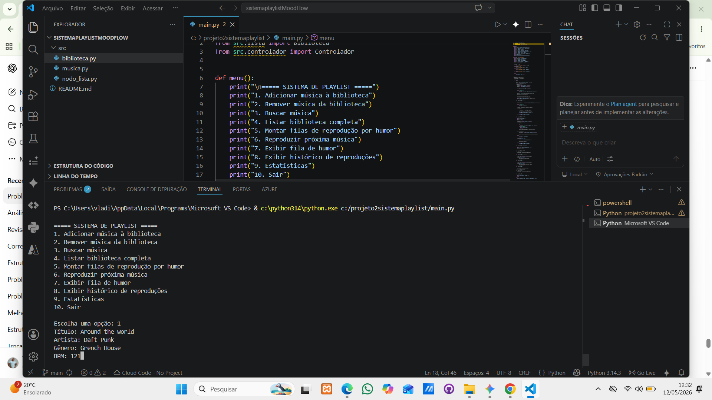
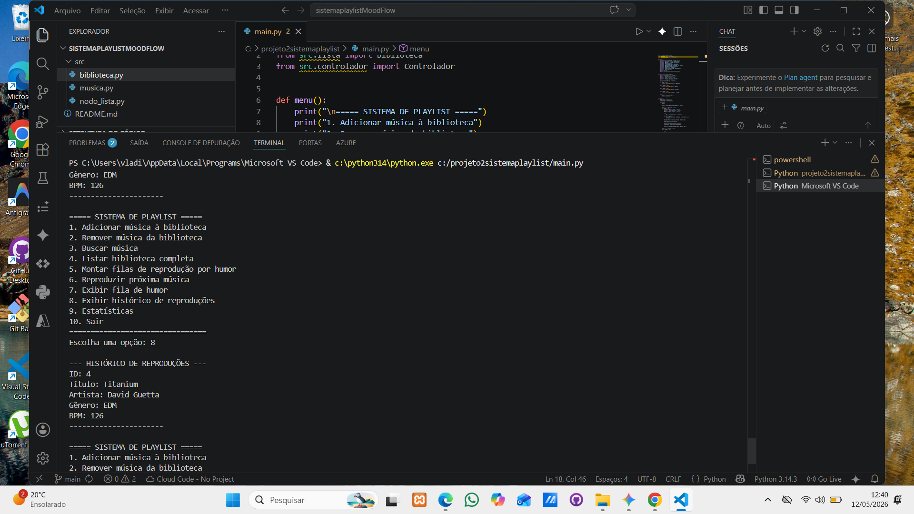
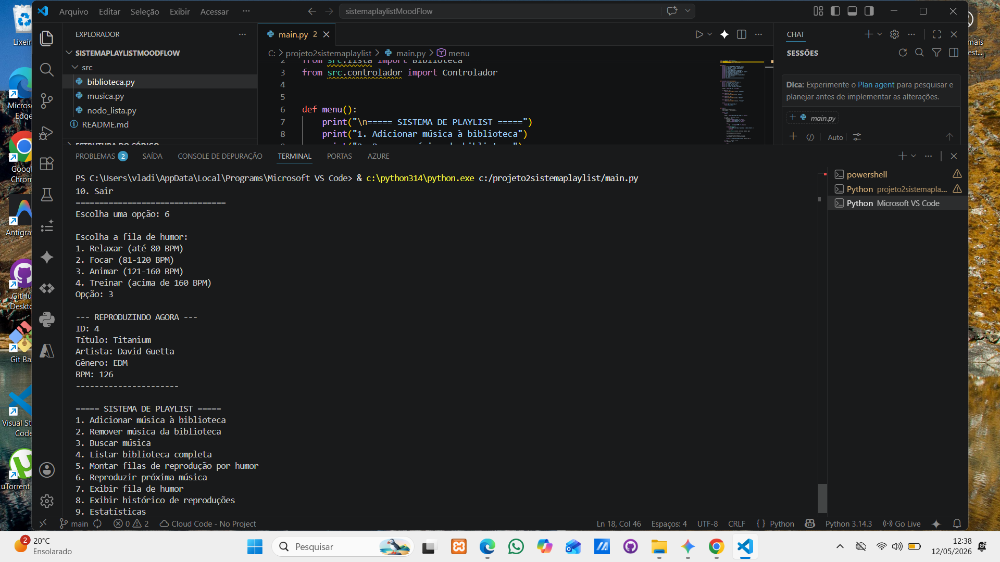
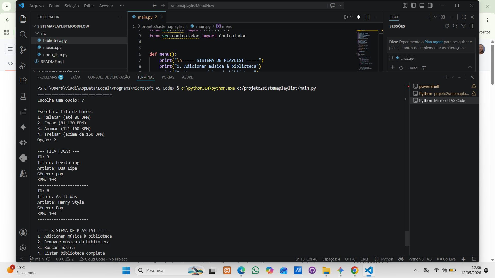
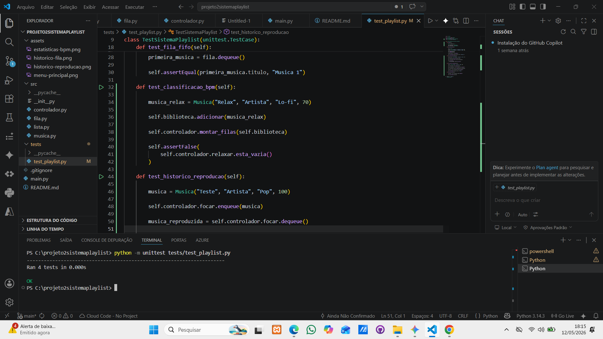

# projeto2sistemaplaylist
Sobre o Projeto: Playlist com Estrutura de Dados. A idéia desse projeto é criar um simulador de playlist, mas o foco não é a música em si, e sim estudar Estrutura de Dados (especialmente Lista Encadeada e um pouco de Fila). É bom deixar claro: o sistema não toca áudio de verdade. As músicas aqui são só "objetos" que a gente usa para aprender como organizar, inserir e buscar informações dentro de uma estrutura.  Para entender melhor: pensa numa lista de contatos do celular. Ela não faz a ligação sozinha, ela só organiza os nomes e números. Ou uma biblioteca, que guarda os livros mas não lê eles para você. Essa playlist é a mesma coisa: ela só organiza os dados das músicas (título, artista, BPM) para a gente treinar como manipular esses dados no código. 
Como o código foi dividido:
Para não virar uma bagunça, separei o projeto em partes menores:  Musica: É onde definimos o que cada música tem (ID, título, artista, etc.).  Lista e Fila: São as "engrenagens". É aqui que a mágica da estrutura acontece, usando nós que se conectam um no outro.  Controlador: É o cérebro que cuida das regras, tipo como adicionar uma música ou montar a fila pelo humor.  Main: É a casca do programa, onde fica o menu para o usuário escolher o que quer fazer.  Por que estamos fazendo assim?
Na faculdade, isso serve para a gente ver na prática como funcionam os Nós, os ponteiros que ligam um elemento ao outro e como percorrer uma lista do começo ao fim. Além disso, separar o código em arquivos diferentes ajuda a entender como organizar um sistema real, onde cada parte tem sua responsabilidade. 
Aviso importante:
Não espere ouvir nada! O projeto não usa áudio, nem Spotify, nem YouTube. O objetivo da nossa disciplina é entender o que acontece "por baixo do capô" na organização dos dados, e não fazer um player de música completo.  

## Classe Musica  (musica.py)
Representa uma música no sistema com título, artista, gênero e BPM.
O ID é gerado automaticamente usando uma variável de classe (`_contador_id`), garantindo que não seja reutilizado mesmo após remoção, conforme o requisito do projeto.
O método `__str__` define como a música é exibida ao usar `print()`.

## Lista Encadeada (Biblioteca) (lista.py)
Representa a estrutura que armazena e organiza as músicas no sistema usando nós ligados entre si. Cada nó guarda uma música e aponta para o próximo, permitindo percorrer a lista do início ao fim.
A classe Biblioteca permite adicionar músicas, listar, buscar por ID ou título, remover e contar elementos. Não utiliza índice, pois o acesso é feito caminhando nó por nó.
O objetivo é entender na prática como funciona uma lista encadeada.
Fila Encadeada (fila.py)Esse arquivo tem a estrutura que controla a ordem das músicas que vão tocar. Eu usei o modelo FIFO, que significa que a primeira música que eu colocar na fila vai ser a primeira a ser tirada para tocar.  Para montar a fila, eu usei nós chamados NodoFila. Cada nó desses guarda uma música e tem um ponteiro proximo que aponta para a próxima música da fila.  Na classe Fila, eu usei dois ponteiros: o inicio e o fim.  O fim serve para eu conseguir adicionar uma música nova lá no final direto, sem precisar ficar percorrendo a fila inteira toda hora (o que deixa o código mais rápido).  O inicio serve para eu sempre saber qual é a primeira música que deve sair.  Eu também coloquei uma verificação para quando a fila ficar vazia. Se eu remover a última música, o código ajusta os ponteiros para None para não dar erro de memória.  Essa mesma estrutura de fila é a que eu uso para separar as músicas pelo BPM (os humores) e também para guardar o histórico das que já tocaram. Tudo foi feito do zero com nós, sem usar as listas prontas (list) do Python, como foi pedido no projeto

## Fila Encadeada (fila.py)
Diferente da lista encadeada, que armazena e permite manipular as músicas livremente, a fila tem como objetivo controlar a ordem de execução. Ela segue o modelo FIFO (First In, First Out), ou seja, a primeira música que entra é a primeira a sair. Essa estrutura representa o conceito abstrato de queue, amplamente utilizado em sistemas computacionais para organizar processamento em sequência, como filas de impressão, execução de tarefas e buffers.  A implementação foi feita com nós encadeados (NodoFila), onde cada nó guarda uma música e aponta para o próximo. O acesso é restrito: não há busca nem remoção no meio da estrutura. Toda inserção ocorre no final da fila (enqueue) e toda remoção ocorre no início (dequeue).
Para isso, a classe mantém dois ponteiros: inicio, que indica a próxima música a ser reproduzida, e fim, que permite inserir novas músicas diretamente no final sem percorrer toda a fila.
Essa estrutura é utilizada para organizar a ordem de reprodução das músicas por humor (baseado no BPM) e também para registrar o histórico, garantindo que a execução siga uma sequência controlada. A implementação foi realizada manualmente com nós, sem uso de estruturas prontas do Python.

## Controlador (controlador.py)

O arquivo controlador.py funciona como o “cérebro” do sistema. Enquanto a classe Biblioteca guarda as músicas e a Fila controla a ordem de reprodução, o Controlador é responsável pelas regras do programa. É nele que acontece a lógica de separar músicas pelos humores, reproduzir músicas e registrar o histórico.
Dentro dessa classe, eu criei cinco filas diferentes usando a estrutura Fila. Quatro delas representam os humores baseados no BPM das músicas: relaxar, focar, animar e treinar. A quinta fila é usada para armazenar o histórico das músicas já reproduzidas.
Quando o usuário escolhe montar as filas de humor, o código percorre toda a biblioteca música por música. Para fazer isso, eu uso um ponteiro chamado atual, que começa no início da lista encadeada e vai caminhando até o final usando atual.proximo. Em cada música, o sistema verifica o BPM e decide em qual fila ela deve entrar.
Se o BPM for até 80, a música vai para a fila relaxar. Se estiver entre 81 e 120, ela vai para focar. Entre 121 e 160, vai para animar. Acima disso, vai para treinar. Essa separação foi baseada diretamente no enunciado do projeto. Antes de montar novamente as filas, o sistema limpa as filas antigas para evitar músicas duplicadas.
Na parte de reprodução, o controlador usa o método dequeue da fila escolhida. Isso significa que a música que entrou primeiro será a primeira a sair, seguindo o conceito FIFO (First In, First Out). Depois de reproduzir a música, o sistema coloca essa mesma música dentro da fila de histórico usando enqueue, mantendo a ordem em que elas tocaram.
Também implementei verificações para evitar erros. Se o usuário tentar montar filas com a biblioteca vazia, o sistema mostra uma mensagem avisando. O mesmo acontece se tentar reproduzir uma música de uma fila vazia.
Na parte de estatísticas, o controlador percorre manualmente tanto a lista encadeada quanto as filas para contar quantos elementos existem em cada estrutura. Isso foi feito sem usar funções prontas do Python, justamente para praticar o funcionamento interno das estruturas encadeadas.
O objetivo dessa classe foi centralizar as regras do sistema em um único lugar, deixando o código mais organizado e separando responsabilidades. Assim, cada arquivo do projeto tem uma função específica dentro do sistema.

## Main (main.py)
O arquivo main.py funciona como a camada de interface do sistema e é responsável pela interação direta com o usuário através do terminal. Enquanto os outros arquivos do projeto armazenam dados e implementam as estruturas encadeadas, o main.py organiza o fluxo geral do programa, exibindo o menu principal, recebendo entradas do usuário e encaminhando cada operação para as classes responsáveis.
Logo no início do arquivo, o sistema importa as bibliotecas internas do projeto utilizando os comandos `from src.musica import Musica`, `from src.lista import Biblioteca` e `from src.controlador import Controlador`. Essas importações são importantes porque conectam o menu principal às estruturas e regras implementadas nos outros arquivos. A classe Musica é utilizada para criar os objetos que representam cada faixa cadastrada. A classe Biblioteca representa a lista encadeada que armazena todas as músicas do sistema. Já a classe Controlador funciona como o cérebro da aplicação, sendo responsável pelas regras de*montagem das filas, reprodução das músicas, histórico e estatísticas.
Dentro do main.py, a função menu() foi criada para exibir visualmente todas as operações disponíveis no sistema. Essa separação ajuda a manter o código mais organizado, evitando repetição de comandos print espalhados pelo programa inteiro. Também foi criada a função escolher_fila(), responsável por centralizar a seleção das filas de humor. Essa função foi utilizada tanto na reprodução de músicas quanto na visualização das filas, evitando duplicação de código e deixando a estrutura mais modularizada.
A função principal do sistema é a main(). Nela são criadas as instâncias da Biblioteca e do Controlador, permitindo que o programa mantenha a lista encadeada das músicas e as filas FIFO de reprodução funcionando durante toda a execução. Em seguida, o programa entra em um laço de repetição com while True, mantendo o menu ativo até que o usuário escolha a opção de saída.
Cada opção do menu foi ligada diretamente aos métodos responsáveis pelas operações do sistema. Quando o usuário adiciona uma música, o main.py coleta os dados digitados, cria um objeto Musica e envia esse objeto para a Biblioteca, que o insere no final da lista encadeada. Nas operações de remoção e busca, o menu apenas solicita as informações necessárias e delega o processamento para a estrutura responsável. Dessa forma, o main.py não implementa diretamente a lógica da lista ou da fila, funcionando apenas como intermediário entre o usuário e as estruturas de dados.
Também foi implementado tratamento de erros para entradas inválidas, principalmente nos campos de BPM e IDs numéricos. Isso impede que o programa encerre inesperadamente caso o usuário digite letras ou valores inválidos. Esse tratamento atende diretamente aos requisitos do projeto descritos no PDF da disciplina.
Durante os testes do sistema, foram verificadas todas as funcionalidades principais do projeto. Foram realizados testes de adição de músicas com diferentes BPMs, montagem das filas de humor, reprodução de músicas, visualização do histórico, busca por ID e título, remoção de músicas e exibição das estatísticas gerais do sistema. Também foram realizados testes de filas vazias, biblioteca vazia, BPM inválido e IDs inexistentes para garantir que o sistema tratasse corretamente situações de erro sem interromper a execução do programa.
Os testes confirmaram que as músicas são distribuídas corretamente entre as filas Relaxar, Focar, Animar e Treinar de acordo com o BPM definido no enunciado. Também foi confirmado que a fila segue corretamente o conceito FIFO (First In, First Out), onde a primeira música adicionada é a primeira música reproduzida. O histórico de reproduções também foi validado, garantindo que as músicas reproduzidas sejam armazenadas em ordem cronológica dentro de uma fila separada.
O objetivo principal do main.py foi manter o sistema organizado e separado em responsabilidades. Enquanto as estruturas encadeadas cuidam do armazenamento e da manipulação dos dados, o menu principal atua apenas como interface de comunicação com o usuário. Essa divisão ajuda a tornar o código mais limpo, modularizado e mais próximo da organização utilizada em sistemas reais.

Além das funcionalidades de controle manual, o arquivo main.py agora integra a biblioteca Faker para permitir a geração automatizada de dados em larga escala através da opção onze do menu principal. Essa implementação foi desenvolvida com o objetivo de testar a robustez das estruturas encadeadas e a eficiência dos algoritmos de classificação sob carga, utilizando o localizador pt_BR para gerar nomes de artistas e títulos de músicas realistas. Ao acionar a função popular_fake, o sistema realiza inserções massivas na lista encadeada da biblioteca e, simultaneamente, demanda que o controlador processe cada novo registro para distribuí-lo entre as filas de humor baseadas em BPM aleatórios. Esse processo é fundamental para validar a integridade dos ponteiros da lista e garantir que o gerador de IDs automáticos mantenha a unicidade dos registros mesmo em cenários de alta densidade de dados, permitindo uma análise estatística profunda do sistema sem a necessidade de entrada manual exaustiva.

## Menu Principal

## Fila de Humor

## Histórico de Reproduções

## Estatísticas por BPM

## Testes Automatizados

O projeto também possui testes automatizados utilizando a biblioteca unittest do Python. Esses testes foram criados para validar o funcionamento das principais estruturas e regras do sistema sem alterar o código principal da aplicação. O objetivo foi garantir que as funcionalidades continuassem funcionando corretamente mesmo após modificações futuras no projeto.
Os testes foram implementados separadamente dentro da pasta tests, mantendo independência total em relação ao fluxo normal do programa. Isso significa que o sistema principal continua funcionando normalmente mesmo sem executar os testes.
Durante os testes automatizados, foram verificadas funcionalidades essenciais do projeto, como o comportamento FIFO da fila encadeada, a classificação correta das músicas por BPM, o armazenamento do histórico de reproduções e o tratamento de filas vazias.
O teste FIFO confirmou que a primeira música adicionada à fila é a primeira música removida, validando corretamente o conceito First In, First Out. Também foi verificado que músicas com BPM adequado são direcionadas corretamente para suas respectivas filas de humor. Além disso, os testes confirmaram que o histórico mantém a ordem cronológica das músicas reproduzidas e que filas vazias são tratadas sem causar falhas no sistema.
A utilização de testes automatizados ajuda a aumentar a confiabilidade do projeto, facilitando futuras manutenções e permitindo validar rapidamente se alterações no código quebraram funcionalidades importantes do sistema.
## Execução dos Testes

